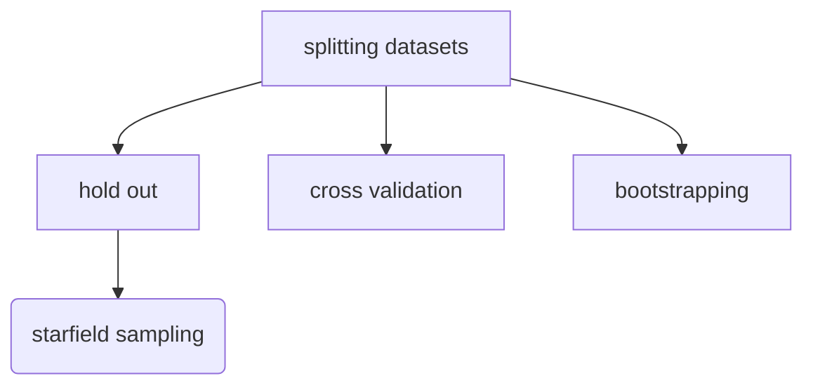
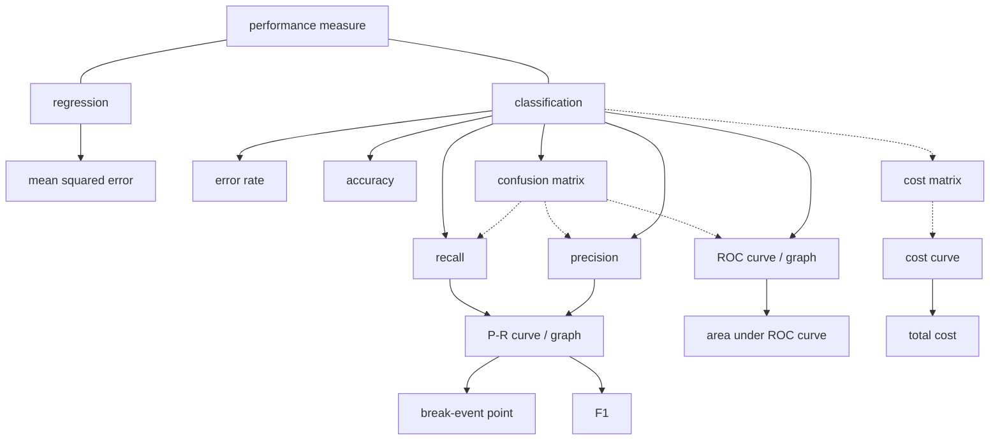
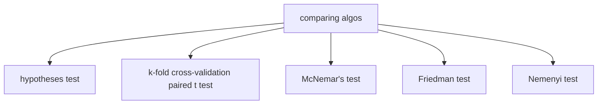
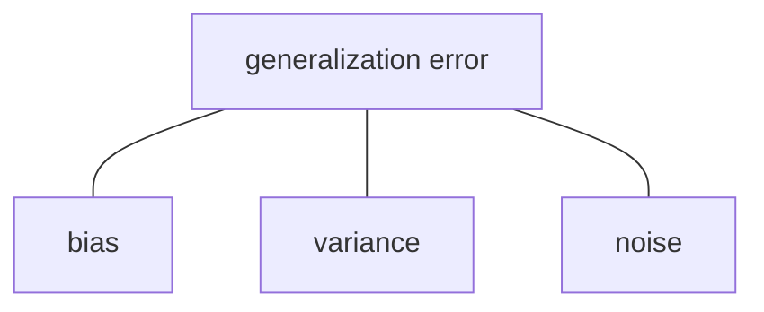

# model evaluation and selection

## splitting training test set

```mermaid
graph
SP[splitting datasets]
SP-->HO[hold out]
HO-->SS(starfield sampling)
SP-->CV[cross validation]
SP-->BS[bootstrapping]
```

## performance measure of learning algorithms

```mermaid
graph
PM[performance measure]
PM---RG[regression]
RG-->MSE[mean squared error]
PM---CF[classification]
CF-->ER[error rate]
CF-->AC[accuracy]
CF-->CM[confusion matrix]
CF-->PC[precision]
CM-.->PC
CM-.->RC
CF-->RC[recall]
PC & RC-->PR[P-R curve / graph]
PR-->BEP[break-event point] & F1
CF--> ROC[ROC curve / graph]
CM-.->ROC
ROC-->AUC[area under ROC curve]
CF-.->CTM[cost matrix]
CTM-.->CC[cost curve]
CC-->TC[total cost]
```

## comparing learning algorithms

```mermaid
graph
CA[comparing algos]
CA-->HT[hypotheses test]
CA-->CT[k-fold cross-validation paired t test]
CA-->MC[McNemar's test]
CA-->F[Friedman test]
CA-->N[Nemenyi test]
```

## bias-variance decomposition

```mermaid
graph
GE[generalization error]
GE---B[bias]
GE---V[variance]
GE---N[noise]
```